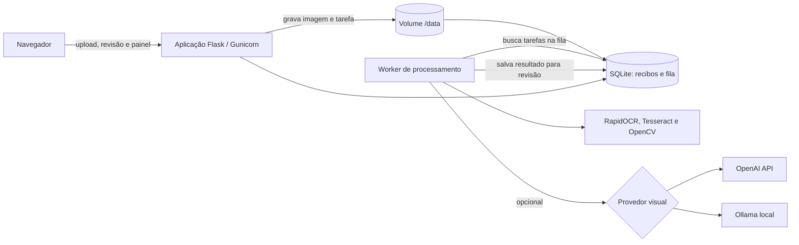
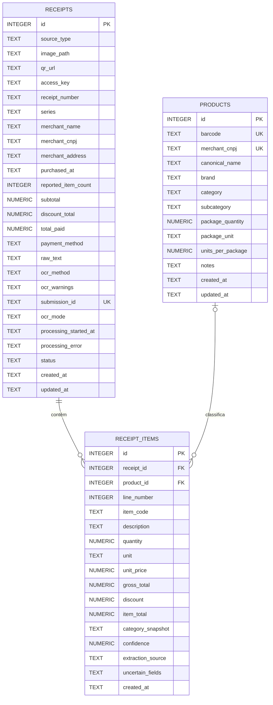

# Controle Mercado

Aplicação web para registrar compras a partir de cupons fiscais, revisar os dados extraídos e acompanhar preços, descontos, estabelecimentos, categorias e hábitos de consumo.

A entrada principal é uma fotografia do cupom. A aplicação combina OCR local, leitura de QR Code e, opcionalmente, um modelo visual da OpenAI ou do Ollama. O processamento pesado ocorre em segundo plano para que o navegador não fique preso enquanto a imagem é analisada.

## Principais recursos

- upload de cupons em JPG, PNG, WEBP ou TIFF;
- processamento assíncrono com fila persistida no SQLite;
- OCR local estruturado para a tabela `# | Cod | Descrição | Qt | Un | Vlr | Total`;
- Tesseract como alternativa quando o layout estruturado não é localizado;
- revisão opcional com OpenAI ou Ollama;
- adaptador nativo para o `glm-ocr`, usando transcrição textual em vez de JSON Schema;
- modo híbrido que envia à LLM somente as linhas duvidosas;
- leitura do QR Code e armazenamento da URL da NFC-e;
- revisão manual antes da confirmação da compra;
- catálogo de produtos com nomes e categorias reaproveitados;
- painel com filtros, indicadores, gráficos e histórico de preços;
- prevenção de recibos duplicados quando o navegador reenvia o formulário;
- retomada de tarefas interrompidas e nova tentativa em caso de falha.

## Arquitetura



O Docker Compose inicia dois serviços usando a mesma imagem e o mesmo volume:

- `app`: atende as páginas e APIs na porta `8000`;
- `worker`: executa OCR, QR Code e chamadas à LLM fora da requisição web.

O SQLite funciona também como fila persistente. O worker reivindica uma tarefa em uma transação, evitando que dois workers processem o mesmo recibo. Uma tarefa que permaneça em processamento além do limite configurado volta automaticamente para a fila.

O Ollama não faz parte do Compose. Por padrão ele é executado no computador hospedeiro e acessado pelo container em `host.docker.internal:11434`.

## Ciclo de vida de um recibo

| Estado | Significado | Entra no painel? |
|---|---|---:|
| `queued` | imagem salva e aguardando o worker | Não |
| `processing` | OCR/LLM em execução | Não |
| `draft` | extração concluída e aguardando revisão | Não |
| `confirmed` | dados revisados e compra confirmada | Sim |
| `failed` | processamento interrompido; pode ser tentado novamente | Não |

A página `/processing` consulta o estado periodicamente e abre a revisão quando o trabalho termina. Ela pode ser fechada sem interromper o processamento.

Cada formulário de upload recebe um `submission_id` único. Se o navegador repetir a mesma requisição, a aplicação reutiliza o recibo já criado em vez de inserir uma duplicata.

## Início rápido com Docker

Pré-requisitos:

- Docker Desktop ou Docker Engine com Docker Compose;
- Ollama, somente se esse provedor for utilizado;
- chave da OpenAI, somente se esse provedor for utilizado.

Na raiz do repositório, crie o arquivo de configuração:

```powershell
Copy-Item .env.example .env
```

Edite o `.env` e inicie a aplicação:

```powershell
docker compose up --build -d
```

Acesse:

- aplicação: http://localhost:8000
- verificação de saúde: http://localhost:8000/api/health

Confira os serviços:

```powershell
docker compose ps
```

Os serviços `app` e `worker` devem estar em execução.

Para acompanhar os logs:

```powershell
docker compose logs -f app worker
```

Para aplicar alterações no código:

```powershell
docker compose up --build -d
```

Para encerrar sem apagar os dados:

```powershell
docker compose down
```

O comando abaixo remove também o banco e todas as imagens do volume. Use-o somente quando quiser apagar os dados permanentemente:

```powershell
docker compose down -v
```

## Fluxo de uso

1. Abra **Novo cupom**.
2. Selecione o motor de leitura.
3. Fotografe ou escolha a imagem do cupom.
4. A aplicação salva o recibo na fila e abre a tela de andamento.
5. O worker executa OCR local, QR Code e, quando necessário, a LLM.
6. Revise estabelecimento, data, totais, itens, descontos e categorias.
7. Corrija os campos sinalizados e confirme a compra.
8. Enriqueça marca, categoria, subcategoria e embalagem em **Produtos**.
9. Acompanhe os dados confirmados no **Painel**.

Também é possível iniciar um recibo manualmente ou informar a URL da NFC-e.

## Processamento da imagem

### OCR local estruturado

O RapidOCR identifica o cabeçalho, o rodapé e a quantidade total de itens. Em seguida, a aplicação calcula a posição de cada linha e reconhece os campos conforme as colunas fixas do cupom:

```text
# | Cod | Descrição | Qt | Un | Vlr | Total
```

Esse processamento linha a linha evita que um item pouco legível faça o OCR ignorar os itens seguintes. Se uma linha não puder ser interpretada, ela ainda é criada como `Item N — revisar OCR`, mantendo a correspondência com a quantidade impressa.

Itens repetidos no mesmo cupom são comparados entre si para corrigir pequenas variações de reconhecimento. Quando o layout estruturado não puder ser localizado, a aplicação utiliza o Tesseract como alternativa.

### Critérios para revisão

Uma linha é encaminhada à revisão da LLM quando apresenta pelo menos uma destas condições:

- código ausente;
- confiança abaixo de `OCR_CONFIDENCE_THRESHOLD`;
- campo essencial não reconhecido;
- diferença superior à tolerância entre `valor bruto - desconto` e `total`.

Mesmo quando a LLM responde, cada item passa por validações de sequência, código, unidade, quantidade, preços e reconciliação matemática. Uma correção inválida não substitui o resultado local.

### Modos disponíveis

| Modo | Comportamento |
|---|---|
| `hybrid` | executa OCR local e envia somente os recortes das linhas duvidosas ao provedor definido em `LLM_PROVIDER` |
| `rapidocr` | processamento totalmente local, sem chamada à LLM |
| `openai` | solicita à OpenAI a interpretação completa do cupom; mantém o OCR local como fallback |
| `ollama` | solicita ao Ollama a interpretação completa do cupom; mantém o OCR local como fallback |

No modo híbrido, os recortes são reunidos em uma imagem compacta e identificados pelo número da linha. Isso reduz o número de pixels e o tempo de inferência, preservando as linhas que já foram reconhecidas com confiança.

Se a LLM falhar, exceder o tempo limite ou produzir uma resposta inválida, o recibo continua disponível com o OCR local e a tela de revisão mostra o aviso correspondente.

## Configurar o Ollama

Instale um modelo com suporte a visão. O `glm-ocr` é recomendado quando a prioridade é transcrever cupons e tabelas com baixa latência:

```powershell
ollama pull glm-ocr
```

Modelos visuais generalistas também são suportados:

```powershell
ollama pull qwen3.5:9b
```

Configuração recomendada para OCR especializado:

```dotenv
OCR_PROVIDER=hybrid
LLM_PROVIDER=ollama
LLM_TIMEOUT_SECONDS=300
OLLAMA_BASE_URL=http://host.docker.internal:11434/v1
OLLAMA_MODEL=glm-ocr
OLLAMA_API_KEY=ollama
OLLAMA_CONTEXT_LENGTH=16384
```

Teste o Ollama no computador hospedeiro:

```powershell
curl.exe http://localhost:11434/api/version
curl.exe http://localhost:11434/api/tags
```

A aplicação utiliza a API nativa `/api/chat`, com JSON Schema, `stream=false`, raciocínio desativado e contexto definido por requisição. A configuração aceita `OLLAMA_BASE_URL` com ou sem o sufixo `/v1`.

`OLLAMA_CONTEXT_LENGTH` afeta somente as requisições desta aplicação. Isso permite manter um contexto global maior no Ollama para outros sistemas. Para cupons, `16384` oferece espaço suficiente para o prompt, a imagem e o JSON estruturado sem reservar o contexto máximo do modelo.

O modelo `glm-ocr` recebe tratamento específico: ele é chamado em modo `Text Recognition`, sem JSON Schema, e sua transcrição é convertida pelo parser da aplicação. Quando o OCR estruturado falha e o `glm-ocr` transcreve o cupom completo, a lista integral validada substitui o fallback do Tesseract, inclusive os metadados e a quantidade informada de itens.

Modelos visuais generalistas, como `qwen3.5`, continuam usando resposta estruturada por JSON Schema. Para utilizá-los, altere apenas:

```dotenv
OLLAMA_MODEL=qwen3.5:9b
```

Em Docker Desktop, `host.docker.internal` aponta do container para o computador hospedeiro. Se o Ollama estiver em outro container ou computador, ajuste a URL.

Modelos visuais locais podem levar mais de um minuto em imagens de recibos. O processamento continuará no worker e não bloqueará a página web.

## Configurar a OpenAI

No `.env`:

```dotenv
OCR_PROVIDER=hybrid
LLM_PROVIDER=openai
OPENAI_API_KEY=sua-chave
OPENAI_MODEL=gpt-5.6-terra
OPENAI_BASE_URL=https://api.openai.com/v1
```

A chave fica somente no servidor/container e não é enviada ao navegador. Quando a OpenAI é utilizada, a imagem completa ou os recortes das linhas duvidosas são enviados à API, conforme o modo escolhido.

## QR Code e consulta da NFC-e

O QR Code é lido localmente com OpenCV. Quando contém uma URL, ela é preservada no recibo.

A consulta automática ao portal fiscal vem desativada:

```dotenv
NFC_FETCH_ENABLED=false
```

Para habilitar:

```dotenv
NFC_FETCH_ENABLED=true
NFC_ALLOWED_HOSTS=dfe.ms.gov.br,sefaz.ms.gov.br,nfce.sefaz.ms.gov.br
```

Por segurança, apenas domínios permitidos, endereços públicos e portas HTTP/HTTPS são aceitos. Alguns portais utilizam CAPTCHA, certificados ou JavaScript e podem impedir a extração automática. Nesses casos, a imagem continua sendo o método principal.

## Catálogo e identificação dos produtos

O campo `Cod` impresso no cupom é o identificador natural do produto:

- códigos com oito ou mais dígitos são tratados como identificadores globais;
- PLUs curtos, como `210`, `246` ou `7360`, são identificados por `CNPJ do estabelecimento + Cod`.

Isso evita colisões entre códigos internos de mercados diferentes. Depois que um produto é revisado, o nome canônico e a categoria são reaproveitados em cupons futuros.

## Modelo de dados

### `receipts`

Uma linha por cupom. Contém origem, imagem, estabelecimento, CNPJ, data, totais, pagamento, QR Code, método de OCR, avisos, estado da fila e a chave idempotente do envio.

### `receipt_items`

Uma linha por item do cupom. Armazena código, descrição, quantidade, unidade, preço unitário, valor bruto, desconto, total, categoria, confiança, origem da extração e campos incertos.

### `products`

Catálogo reutilizável com nome canônico, marca, categoria, subcategoria, dados de embalagem e escopo do código do produto.

### Diagrama entidade-relacionamento



Regras de integridade e índices:

- `receipt_items.receipt_id` é obrigatório e referencia `receipts.id`;
- ao excluir um recibo, seus itens são removidos por `ON DELETE CASCADE`;
- `receipt_items.product_id` é opcional e referencia `products.id`;
- ao excluir um produto, o item histórico é preservado e `product_id` recebe `NULL` por `ON DELETE SET NULL`;
- `receipts.submission_id` possui índice único quando preenchido, garantindo idempotência do upload;
- o par `products.merchant_cnpj + products.barcode` é único quando o código está preenchido;
- existem índices para data e CNPJ do recibo e para as duas chaves estrangeiras dos itens.

As migrações necessárias são aplicadas automaticamente na inicialização. O banco e as imagens ficam no volume Docker `mercado_data`, montado em `/data`.

## Dados iniciais

Na primeira execução, a aplicação importa automaticamente `data/seed_compras.json` quando o banco está vazio. A importação é idempotente e não é repetida em um banco já preenchido.

## Estrutura do projeto

```text
controle-mercado/
├── compose.yaml                 # serviços app e worker
├── Dockerfile                  # imagem Python, OCR e servidor web
├── requirements.txt            # dependências Python
├── wsgi.py                     # entrada do Gunicorn
├── .env.example                # exemplo de configuração
├── data/
│   └── seed_compras.json       # histórico inicial
├── mercado/
│   ├── __init__.py             # fábrica da aplicação e configurações
│   ├── routes.py               # páginas, formulários e APIs
│   ├── db.py                   # conexão, schema e migrações
│   ├── schema.sql              # tabelas e índices
│   ├── categories.py           # categorias e inferência inicial
│   ├── worker.py               # consumidor da fila de recibos
│   ├── services/
│   │   ├── analytics.py        # dados do painel
│   │   ├── llm_ocr.py          # conectores OpenAI e Ollama
│   │   ├── nfce.py             # consulta segura da NFC-e
│   │   ├── ocr.py              # orquestração OCR, LLM e QR Code
│   │   ├── parser.py           # interpretação dos textos do cupom
│   │   ├── receipt_jobs.py     # fila, retomada, sucesso e falha
│   │   ├── seed.py             # importação dos dados iniciais
│   │   └── structured_ocr.py   # leitura posicional linha a linha
│   ├── templates/              # páginas HTML/Jinja
│   └── static/                 # CSS e JavaScript
└── tests/
    ├── test_app.py             # fluxos web, fila e idempotência
    ├── test_llm_ocr.py         # conectores, recortes e validações
    └── test_parser.py          # interpretação das linhas
```

## Rotas principais

| Rota | Finalidade |
|---|---|
| `/` | painel analítico |
| `/receipts` | histórico e estados dos cupons |
| `/receipts/new` | formulário de entrada |
| `/receipts/<id>/processing` | acompanhamento do worker |
| `/receipts/<id>/review` | revisão e confirmação |
| `/products` | catálogo de produtos |
| `/api/receipts/<id>/status` | estado do processamento |
| `/api/analytics` | dados filtrados do painel |
| `/api/health` | verificação de saúde da aplicação |

## Variáveis de ambiente

| Variável | Padrão | Finalidade |
|---|---|---|
| `SECRET_KEY` | valor de desenvolvimento | proteção da sessão Flask |
| `APP_DATA_DIR` | `/data` | diretório do banco e das imagens |
| `MAX_UPLOAD_MB` | `15` | tamanho máximo da imagem |
| `TESSERACT_LANG` | `por` | idioma principal do Tesseract |
| `OCR_PROVIDER` | `hybrid` | modo inicial: `hybrid`, `rapidocr`, `openai` ou `ollama` |
| `OCR_CONFIDENCE_THRESHOLD` | `0.75` | confiança mínima antes de solicitar revisão à LLM |
| `LLM_PROVIDER` | `openai` | provedor utilizado pelo modo híbrido |
| `LLM_TIMEOUT_SECONDS` | `300` | tempo máximo de uma chamada à LLM no worker |
| `LLM_IMAGE_DETAIL` | `high` | nível de detalhe enviado à OpenAI |
| `OPENAI_API_KEY` | vazio | chave da API OpenAI |
| `OPENAI_MODEL` | `gpt-5.6-terra` | modelo visual da OpenAI |
| `OPENAI_BASE_URL` | `https://api.openai.com/v1` | endpoint da OpenAI |
| `OLLAMA_BASE_URL` | `http://host.docker.internal:11434/v1` | endereço do Ollama |
| `OLLAMA_MODEL` | `qwen3-vl:8b` | modelo visual do Ollama |
| `OLLAMA_API_KEY` | `ollama` | valor de compatibilidade; o Ollama local normalmente não valida a chave |
| `OLLAMA_CONTEXT_LENGTH` | `16384` | contexto enviado como `num_ctx` somente nas chamadas desta aplicação |
| `WORKER_POLL_SECONDS` | `1` | intervalo de consulta da fila |
| `PROCESSING_STALE_MINUTES` | `20` | tempo para retomar uma tarefa interrompida |
| `NFC_FETCH_ENABLED` | `false` | habilita a consulta da URL fiscal |
| `NFC_ALLOWED_HOSTS` | portais de MS | domínios fiscais permitidos |

Valores definidos no `.env` substituem os padrões do Compose.

## Desenvolvimento sem Docker

Instale as dependências Python e o Tesseract com o idioma português. Depois, execute o servidor e o worker em terminais separados:

```powershell
python -m pip install -r requirements.txt
$env:APP_DATA_DIR = "$PWD\data"
python -m flask --app wsgi:app run --debug
```

Em outro terminal, com as mesmas variáveis de ambiente:

```powershell
$env:APP_DATA_DIR = "$PWD\data"
python -m mercado.worker
```

## Testes

Execute na raiz do projeto ou dentro do container:

```powershell
python -m unittest discover -s tests -v
```

Os 18 testes cobrem parser, colunas fixas, códigos PLU, OCR híbrido, conectores OpenAI/Ollama, adaptador `glm-ocr`, substituição do fallback completo, recortes das linhas, contexto por requisição, fila assíncrona, falhas, nova tentativa e prevenção de duplicidades.

## Diagnóstico

### O recibo permanece em `Na fila`

Verifique se o serviço `worker` está ativo:

```powershell
docker compose ps
docker compose logs --tail=100 worker
```

### Aviso de timeout do Ollama

O recibo não é perdido: o OCR local é preservado. Verifique se o modelo está carregado e se a GPU possui memória disponível:

```powershell
curl.exe http://localhost:11434/api/ps
nvidia-smi
```

O modo híbrido é recomendado para modelos locais porque envia apenas as linhas duvidosas.

### O container não alcança o Ollama

Confirme primeiro que `http://localhost:11434/api/version` responde no computador. No Docker Desktop, mantenha `OLLAMA_BASE_URL=http://host.docker.internal:11434/v1`.

### Página antiga após uma atualização

Reconstrua os containers e faça uma atualização completa do navegador:

```powershell
docker compose up --build -d
```

Depois use `Ctrl+F5` na página.

## Segurança e privacidade

- não publique o `.env` nem chaves de API;
- as imagens enviadas ficam persistidas em `/data/uploads`;
- no modo OpenAI, a imagem ou os recortes são enviados ao provedor externo;
- no modo Ollama e no modo `rapidocr`, o processamento visual permanece local;
- a consulta da NFC-e utiliza uma lista explícita de domínios para reduzir risco de acesso indevido a endereços internos;
- a aplicação ainda não possui autenticação; exponha a porta somente em uma rede confiável.

## Limitações atuais

- o SQLite é adequado para uso pessoal ou poucos usuários, mas não para alta concorrência;
- portais de NFC-e variam por estado e podem exigir CAPTCHA, certificado ou JavaScript;
- fotos desfocadas, inclinadas ou com reflexos ainda podem exigir correção manual;
- o painel utiliza Chart.js por CDN; sem internet, os registros e tabelas continuam disponíveis, mas os gráficos podem não carregar;
- para vários usuários ou múltiplos workers em produção, recomenda-se migrar a persistência e a fila para PostgreSQL e um sistema dedicado de tarefas.

## Próximas evoluções sugeridas

- adaptadores de consulta da NFC-e por estado;
- comparação automática entre dados fiscais e OCR;
- botão para reprocessar um rascunho com outro motor;
- autenticação e separação por usuário;
- backup e exportação dos dados;
- PostgreSQL e fila dedicada para maior concorrência.
